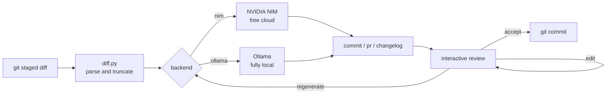
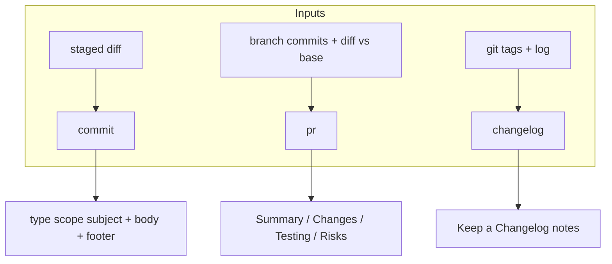

# ai-commit

**Turn your git diff into good writing.** A CLI that drafts your commit messages, pull request descriptions and changelogs straight from the staged diff — as [Conventional Commits](https://www.conventionalcommits.org), with an interactive accept/edit/regenerate loop and an optional git hook. Runs on the **free NVIDIA NIM** cloud or a **fully local Ollama** model with a single flag.


---

## Why

Writing `git commit -m "fix stuff"` for the fifth time today is a small tax you pay forever. A clean history — Conventional Commits, real subjects, bodies that explain *why* — pays for itself in `git log`, `git blame`, automated changelogs and semantic-version bumps. But nobody wants to hand-write it.

`ai-commit` reads what you already staged and proposes a message that follows your project's rules. You accept, tweak, or ask for another take. The same engine writes your PR description from the branch and your release notes from the tags. It is intentionally small, has four dependencies, and never sends your code anywhere except the backend **you** pick — set `backend: ollama` and the diff never leaves your machine.

## How it works



The diff is parsed into per-file records first, so binaries and lockfiles are dropped and huge diffs are condensed — full patch, then hunk headers, then a one-line stat per file — to stay inside the model's context window. The model only ever sees a prompt-sized view.



## Quickstart

```bash
# 1. Clone
git clone https://github.com/AleBrito124356/ai-commit
cd ai-commit

# 2. Install (pipx keeps it isolated and on your PATH)
pipx install .
# or, for hacking on it:  pip install -e ".[dev]"

# 3. Configure a backend
cp .env.example .env
```

**Free NVIDIA NIM (default).** Create a free account at [build.nvidia.com](https://build.nvidia.com) — it takes about two minutes — and generate an API key. It starts with `nvapi-`. Then:

```bash
export NVIDIA_API_KEY=nvapi-XXXXXXXXXXXXXXXXXXXXXXXX
```

**Fully local Ollama.** Install [Ollama](https://ollama.com), then:

```bash
ollama serve
ollama pull llama3.1
aicommit --backend ollama            # or set backend: ollama in .aicommit.yaml
```

Drop a config file in your project so the whole team shares conventions:

```bash
aicommit init                        # writes a starter .aicommit.yaml
```

## Usage

### Commit

Stage your changes, then run `aicommit` with no arguments. It reads the staged diff and opens an interactive review:

```console
$ git add .
$ aicommit

╭───────────────────────── Proposed commit ─────────────────────────╮
│ feat(diff): condense large diffs to fit the model context          │
│                                                                    │
│ Parse the staged diff per file and progressively drop patch        │
│ bodies to hunk headers, then to stat lines, when over budget.      │
╰────────────────────────────────────────────────────────────────────╯
  ✓ valid Conventional Commit

           Alternatives
  # Header
  1 feat(diff): condense large diffs to fit the model context
  2 perf(diff): truncate oversized diffs before prompting

  Action  a=accept  e=edit  r=regenerate  #=pick alt  q=quit: a
  ✓ committed a1b2c3d
```

- **a** accepts and commits.
- **e** opens the message in `$EDITOR` for a quick tweak.
- **r** regenerates with more variety.
- **1**, **2**, … swaps in an alternative.
- **q** aborts without committing.

Handy flags:

```bash
aicommit -a                 # stage everything first (git add -A)
aicommit -y                 # accept the top suggestion, no prompt
aicommit --dry-run          # show the message, do not commit
aicommit --hint "closes #212"   # nudge the model
aicommit --language es      # write in Spanish
aicommit --emoji            # prefix with a gitmoji
```

### Pull request description

From a feature branch, summarize everything versus a base branch as review-ready markdown:

```console
$ aicommit pr --base main
# Add local Ollama backend and diff truncation

## Summary

Adds a second backend so the tool runs fully offline, and a truncation
strategy so large diffs never exceed the model context window.

## Changes
- Add an Ollama-backed client selectable with --backend ollama
- Condense diffs progressively when over the character budget
- Skip binary files and lockfiles from the prompt

## Testing
- Unit tests for diff parsing and truncation thresholds
- Manual run against a 40-file refactor branch

## Risks
- None; the default NIM path is unchanged
```

Write it straight to a file with `-o pr.md`.

### Changelog

Produce [Keep a Changelog](https://keepachangelog.com) release notes grouped by Conventional-Commit type. Grouping is deterministic and works **offline** — no backend needed:

```console
$ aicommit changelog --from v1.2.0 --version 1.3.0
## [1.3.0] - 2026-07-19

### Added
- **diff:** condense large diffs to fit the model context (`a1b2c3d`)

### Fixed
- **hook:** skip prefill on merge and squash commits (`d4e5f6a`)
```

```bash
aicommit changelog --full           # regenerate the entire CHANGELOG across all tags
aicommit changelog --polish         # rewrite entries in prose (uses the backend)
aicommit changelog --include-internal   # keep docs/chore/ci/test/build/style
```

### Git hook

Install a `prepare-commit-msg` hook so `git commit` opens with a suggestion already filled in — edit or accept as usual:

```console
$ aicommit hook install
✓ Installed prepare-commit-msg hook at .git/hooks/prepare-commit-msg

$ aicommit hook status
installed and managed by aicommit at .git/hooks/prepare-commit-msg

$ aicommit hook uninstall
✓ Removed aicommit hook
```

The hook is a no-op for merges, squashes, amends and `git commit -m`, and it never blocks a commit if the backend is unreachable — worst case, you type the message yourself. An existing hook is backed up and restored on uninstall.

## Configuration

`aicommit` reads `.aicommit.yaml` from the nearest parent directory. Precedence, lowest to highest: built-in defaults → `~/.aicommit.yaml` → project `.aicommit.yaml` → `AICOMMIT_*` environment variables → command-line flags.

| Key                  | Default                    | Meaning                                             |
| -------------------- | -------------------------- | --------------------------------------------------- |
| `backend`            | `nim`                      | `nim` for free NVIDIA cloud, `ollama` for local     |
| `model`              | backend default            | Model id override                                   |
| `language`           | `en`                       | Output language, `en` or `es`                       |
| `allowed_types`      | feat, fix, docs, …         | Types accepted by validation                        |
| `subject_max_length` | `72`                       | Hard cap on the subject line                        |
| `emoji`              | `false`                    | Prefix each message with a gitmoji                  |
| `pr_base`            | `main`                     | Default base branch for `aicommit pr`               |
| `max_diff_chars`     | `12000`                    | Prompt budget before the diff is condensed          |

Default models: `meta/llama-3.3-70b-instruct` on NIM (override with `NIM_MODEL`), `llama3.1` on Ollama (override with `OLLAMA_MODEL`).

## Privacy

The diff only ever goes to the backend you choose. With `backend: nim` it goes to NVIDIA's endpoint over HTTPS; with `backend: ollama` it goes to `localhost` and **nothing leaves your machine** — ideal for private or client code. The tool never reads history, never phones home, and never writes your key anywhere. Lockfiles and binaries are stripped before the prompt is even built.

## Project structure

```text
ai-commit/
├── cli.py                     # dev shim: run without installing
├── src/aicommit/
│   ├── cli.py                 # Typer + Rich CLI and interactive loop
│   ├── config.py              # .aicommit.yaml with layered precedence
│   ├── diff.py                # parse, filter and truncate the staged diff
│   ├── commit.py              # Conventional Commit model, validate, generate
│   ├── pr.py                  # PR title + Summary/Changes/Testing/Risks
│   ├── changelog.py           # Keep a Changelog notes grouped by type
│   ├── hook.py                # install/uninstall prepare-commit-msg hook
│   ├── llm.py                 # one OpenAI-compatible client for NIM or Ollama
│   ├── prompts.py             # inspectable, language-aware prompt builders
│   └── gitutil.py             # thin, mockable git wrappers
├── tests/                     # temp-git-repo fixtures, LLM fully mocked
│   ├── test_diff.py
│   ├── test_commit.py
│   ├── test_changelog.py
│   ├── test_config.py
│   └── test_hook.py
├── .aicommit.yaml             # this repo dogfoods its own config
├── .env.example
├── pyproject.toml
└── requirements.txt
```

## Development

```bash
pip install -e ".[dev]"
pytest                          # 49 tests; no network, LLM mocked
```

Tests spin up a throwaway git repository per case and mock the LLM client, so the whole suite runs offline in a couple of seconds.

## Related projects

Part of a family of small, free-NVIDIA-NIM tools by the same author:

- [**ollama-local-llm-kit**](https://github.com/AleBrito124356/ollama-local-llm-kit) — run LLMs locally with Ollama and flip to free NIM with one flag; the backend switch here is the same idea.
- [**code-review-agent**](https://github.com/AleBrito124356/code-review-agent) — automated code review for GitHub PRs and diffs; a natural companion once your commits and PRs are clean.
- [**git-hooks-collection**](https://github.com/AleBrito124356/git-hooks-collection) — a curated set of git hooks with a one-command installer, including a real secret scanner and Conventional-Commit checks.
- [**python-cli-template**](https://github.com/AleBrito124356/python-cli-template) — the batteries-included Typer + Rich starter this CLI is built in the spirit of.

## License

MIT — see [LICENSE](LICENSE). Copyright (c) 2026 Alejandro Brito.
