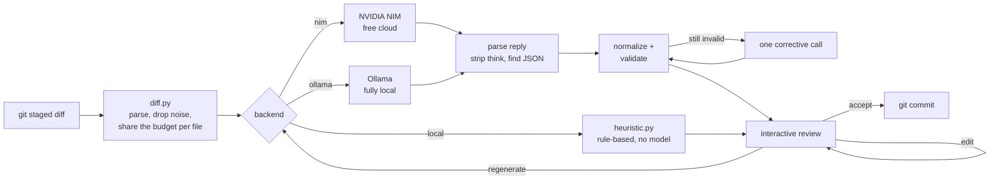
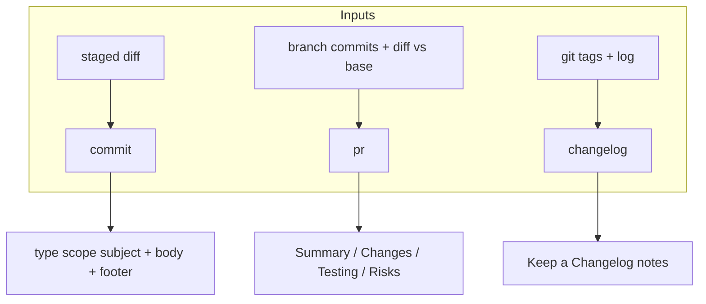

# ai-commit

**Turn your git diff into good writing.** A CLI that drafts your commit messages, pull request descriptions and changelogs straight from the staged diff — as [Conventional Commits](https://www.conventionalcommits.org), with an interactive accept/edit/regenerate loop and an optional git hook. Runs on the **free NVIDIA NIM** cloud or a **fully local Ollama** model with a single flag — or, with no account and no model at all, on a **rule-based `local` backend** that drafts from the diff itself.


---

## Why

Writing `git commit -m "fix stuff"` for the fifth time today is a small tax you pay forever. A clean history — Conventional Commits, real subjects, bodies that explain *why* — pays for itself in `git log`, `git blame`, automated changelogs and semantic-version bumps. But nobody wants to hand-write it.

`ai-commit` reads what you already staged and proposes a message that follows your project's rules. You accept, tweak, or ask for another take. The same engine writes your PR description from the branch and your release notes from the tags. It is intentionally small, has five runtime dependencies (Typer, Click, Rich, httpx and PyYAML), and never sends your code anywhere except the backend **you** pick — set `backend: ollama` and the diff never leaves your machine; set `backend: local` and nothing is sent anywhere.

It is built for real models, not demo models: small local models drift (`"Feature"` as a type, past-tense subjects, 90-character subjects), reasoning models wrap their answer in `<think>` blocks, free tiers rate-limit. Every reply is parsed defensively, repaired into a valid Conventional Commit, and — only if it still breaks the rules — sent back to the model once with the exact problems to fix.

## Try it with no account (rule-based, not AI)

```bash
pipx install .                 # from a clone of this repo
cd your-project && git add -p
aicommit --backend local
```

This is real output for a change that adds a guard to `charge()` plus a test:

```console
$ aicommit --backend local

╭────────── Proposed commit (rule-based draft, no AI) ──────────╮
│ fix(payments): handle InvalidAmountError in charge with tests │
│                                                               │
│ - src/shop/payments.py (+2 -0): in charge                     │
│ - tests/test_payments.py (+5 -0): adds test_rejects_zero      │
╰───────────────────────────────────────────────────────────────╯
  ✓ valid Conventional Commit
                            Alternatives
#  Header
1  fix(payments): handle InvalidAmountError in charge with tests
2  refactor(payments): handle InvalidAmountError in charge with tests
3  fix: handle InvalidAmountError in charge with tests
  Action a=accept  e=edit  r=regenerate  #=pick alt  q=quit:
```

**The `local` backend is not AI.** It reads the parsed diff and applies transparent rules, so it needs no key, no network and no GPU. Every draft is a valid Conventional Commit, but it can only name what the diff shows; it cannot know *why* you made the change. Use it to try the workflow, in air-gapped machines or CI, and as the git hook's fallback. Switch to NIM or Ollama for messages that explain intent.

| Signal in the diff | Draft |
| ------------------ | ----- |
| only test files | `test: add tests for auth` / `update tests for …` |
| only docs (`*.md`, `docs/`) | `docs: update README and install.md` |
| only CI config (`.github/workflows`, `.gitlab-ci.yml`, …) | `ci: update ci workflow` |
| only lockfiles / dependency lines in manifests | `build(deps): update dependencies` |
| whitespace-only edits | `style: format app` |
| new source file | `feat(payments): add retry` |
| new function or class in a file | `feat(diff): add plan_render` |
| added guard / raised exception in a small change | `fix(auth): handle AccountLocked in login` |
| caching / memoization added | `perf(repo): cache lookup` |
| deletions only, renames, moves | `refactor: remove legacy`, `refactor: rename util.py to helpers.py` |

The scope is the one module the change is about (`src/auth.py` + `tests/test_auth.py` → `auth`) or the deepest non-generic directory. The function names come from the definitions the diff adds and from the function each hunk sits in. `r` (regenerate) cycles through the alternatives. An issue reference in `--hint "closes #42"` becomes the footer `Closes #42`. Drafts are available in English and Spanish (`--language es`).

## How it works



**The prompt budget is shared per file, not all-or-nothing.** Every file keeps a one-line stat. The rest of `max_diff_chars` is shared by weighted fair share: source code first, then build/CI/config, tests, docs, and data or fixtures last. Small files keep their full patch and hand unused budget on to bigger ones. A file too big for its share is condensed to its hunk headers (with the function each hunk is in) plus as many changed lines per hunk as fit. For example, a 14 KB diff made of a 400-line `data/fixtures.json` and a one-line fix in `src/auth.py`, with a 12,000-char budget, keeps the full `src/auth.py` patch and a sample of the fixture. The output never exceeds the budget.

Binaries, lockfiles, minified bundles (`*.min.js`, `*.min.css`), source maps, snapshots (`*.snap`), `dist/`, `build/`, `vendor/`, `node_modules/`, files with an `@generated` / `Code generated … DO NOT EDIT` header, files marked `linguist-generated` or `linguist-vendored` in `.gitattributes`, and anything in your `ignore_paths` are named in the prompt but their content is never sent.



## Quickstart

```bash
# 1. Clone
git clone https://github.com/AleBrito124356/ai-commit
cd ai-commit

# 2. Install (pipx keeps it isolated and on your PATH)
pipx install .
# or, for hacking on it:  pip install -e ".[dev]"

# 3. Pick a backend (below). With none configured, try: aicommit --backend local
```

`aicommit` reads its settings from environment variables and `.aicommit.yaml`. **It does not load a `.env` file.** [`.env.example`](.env.example) lists every variable it understands. Either `export` them in your shell, or keep a `.env` and load it with a tool such as [direnv](https://direnv.net).

**Free NVIDIA NIM (default).** Create a free account at [build.nvidia.com](https://build.nvidia.com) — it takes about two minutes — and generate an API key. It starts with `nvapi-`. Then:

```bash
export NVIDIA_API_KEY=nvapi-XXXXXXXXXXXXXXXXXXXXXXXX
```

**Fully local Ollama.** Install [Ollama](https://ollama.com), then:

```bash
ollama serve
ollama pull llama3.1
aicommit --backend ollama            # or set backend: ollama in .aicommit.yaml
```

Reasoning models such as `qwen3` or `deepseek-r1` (`OLLAMA_MODEL=qwen3:8b`) put `<think>…</think>` before their answer; that block is stripped before parsing.

**No model at all.** `aicommit --backend local` — see [Try it with no account](#try-it-with-no-account-rule-based-not-ai).

Drop a config file in your project so the whole team shares conventions:

```bash
aicommit init                        # writes a starter .aicommit.yaml
```

You can also run the tool as a module: `python -m aicommit ...`.

## Usage

### Commit

Stage your changes, then run `aicommit` with no arguments. It reads the staged diff and opens an interactive review:

```console
$ git add .
$ aicommit

╭───────────────────────── Proposed commit ─────────────────────────╮
│ feat(diff): condense large diffs to fit the model context          │
│                                                                    │
│ Share the prompt budget per file so small source changes keep      │
│ their full patch while oversized fixtures are condensed.           │
╰────────────────────────────────────────────────────────────────────╯
  ✓ valid Conventional Commit
           Alternatives
#  Header
1  feat(diff): condense large diffs to fit the model context
2  perf(diff): truncate oversized diffs before prompting

  Action a=accept  e=edit  r=regenerate  #=pick alt  q=quit: a
✓ committed a1b2c3d
```

- **a** accepts and commits.
- **e** opens the message in `$EDITOR` for a quick tweak.
- **r** regenerates with more variety.
- **1**, **2**, … swaps in an alternative.
- **q** aborts without committing.

Handy flags:

```bash
aicommit -a                 # stage everything first (git add -A)
aicommit -y                 # accept the top suggestion, no prompt
aicommit --dry-run          # show the message, do not commit
aicommit --hint "closes #212"   # nudge the model
aicommit --language es      # write in Spanish
aicommit --emoji            # prefix with a gitmoji
aicommit -v                 # trace to stderr: diff condensation, prompt sizes, raw reply
```

### What happens to the model's reply

Before you see a proposal, the reply goes through these steps:

1. **Reasoning is stripped.** `<think>…</think>` (and `<thinking>`, a dangling `</think>`, or an unterminated `<think>`) is removed.
2. **The JSON is found, not guessed.** A string-aware brace scanner returns the first object that really parses, preferring the expected keys. Prose or stray braces on either side (`Note: {alternatives omitted}`) do not matter, and trailing commas are forgiven. Plain-text replies are scanned line by line for a `type(scope): subject` header.
3. **Drift is repaired mechanically.** `Feature`/`bugfix`/`doc`/`tests`/`performance` map to `feat`/`fix`/`docs`/`test`/`perf`. `feat(api)!` in the type field is split into type, scope and `!`. Scopes are cleaned (`"null"` or empty → none, `Search Index` → `search-index`). A repeated `feat:` prefix and a trailing period are removed. `Added`/`Fixes`/`Using` become `add`/`fix`/`use` (English only). The first letter is lowercased unless it is an acronym (`API`, `README`, `GitHub`). An overlong subject is cut at a clause boundary: `…lookups so that repeated queries are faster.` → `…lookups`. `"breaking": "false"` is not a breaking change.
4. **One corrective call, only if needed.** If the primary proposal still fails validation (for example, a type your project does not allow), the model is asked once more with the list of problems, and the best candidate from both answers wins.
5. **Errors stay readable.** An empty reply is `error: model returned an empty reply` (with a hint when the model hit its token limit), never a traceback. Rate limits (429) and transient 5xx or dropped connections are retried up to 3 times with exponential backoff that honours `Retry-After` (never waiting more than 30 s). A 401 or an unknown Ollama model gets a backend-specific hint.

`-v` shows every step. The trace below was recorded against a local OpenAI-compatible stub that answers the way a drifting reasoning model does (a `<think>` block, `"Feature"`, a past-tense 84-character subject, `"breaking": "false"`):

```console
$ OLLAMA_MODEL=qwen3:8b aicommit --backend ollama -v -y --dry-run
diff stage 'full': 266 -> 266 chars (budget 12,000) - full: src/shop/refunds.py
prompt -> ollama/qwen3:8b: system 1,198 + user 398 chars, temperature 0.3, max_tokens 1500
reply <- 330 chars in 0.3s (finish_reason=stop, http attempts=1)
raw reply:
<think>
The user wants a commit. The diff touches {refund}...
</think>
{"primary": {"type": "Feature", "scope": "Refunds", "subject": "Added an optional reason to refunds
so that support can see why a refund was issued."}, "alternatives": [{"type": "feat", "scope": null,
"subject": "record refund reasons", "breaking": "false"}]}
normalized: type 'feature' -> 'feat'
normalized: scope 'Refunds' -> 'refunds'
normalized: subject 'Added an optional reason to refunds so that support can see why a refund was
issued.' -> 'add an optional reason to refunds'

╭──────────────── Proposed commit ─────────────────╮
│ feat(refunds): add an optional reason to refunds │
╰──────────────────────────────────────────────────╯
  ✓ valid Conventional Commit
```

### Pull request description

From a feature branch, summarize everything versus a base branch as review-ready markdown:

```console
$ aicommit pr --base main
# Add local Ollama backend and diff truncation

## Summary

Adds a second backend so the tool runs fully offline, and a truncation
strategy so large diffs never exceed the model context window.

## Changes

- Add an Ollama-backed client selectable with --backend ollama
- Condense diffs progressively when over the character budget
- Skip binary files and lockfiles from the prompt

## Testing

- Unit tests for diff parsing and truncation thresholds
- Manual run against a 40-file refactor branch

## Risks

- None; the default NIM path is unchanged
```

Write it straight to a file with `-o pr.md`. The git side is checked before any backend is contacted:

- A branch with no commits of its own fails with `error: no commits on 'main' that are not already on 'main'; nothing to describe`. The model is never asked to invent a description.
- When the base only exists as a remote-tracking branch (fresh clones, CI checkouts), `origin/<base>` is used.
- An empty title falls back to the first commit's subject.

With `--backend local` the description is deterministic. It is built from the commit subjects (grouped by type) and the diffstat, and flags breaking commits, deleted files, dependency, CI and migration changes. Real output:

```console
$ aicommit --backend local pr --base main
local backend: rule-based summary of commits and diffstat, no AI
# Add refunds

## Summary

3 commits on `feature/refunds` compared with `main`: 1 feature, 1 fix, 1 build change. Touches 4 files (+10 -0), mostly in tests/ and src/.

## Changes

- feat(shop): add refunds
- fix(payments): handle InvalidAmountError in charge with tests
- build(deps): update dependencies

## Testing

- Test files changed: `tests/test_payments.py`

## Risks

- Changes dependencies or build files: `requirements.txt`
```

### Changelog

Produce [Keep a Changelog](https://keepachangelog.com) release notes grouped by Conventional-Commit type. Grouping is deterministic and works **offline** — no backend needed:

```console
$ aicommit changelog
## [Unreleased]

### Added
- **shop:** add refunds (`0f8e37a`)
- **payments:** charge cards (`021774d`)

### Fixed
- **payments:** handle InvalidAmountError in charge with tests (`2b32dd4`)

$ aicommit changelog --from v1.2.0 --version 1.3.0
## [1.3.0] - 2026-07-19
...
```

```bash
aicommit changelog --full           # regenerate the entire CHANGELOG across all tags
aicommit changelog --polish         # rewrite entries in prose (needs nim or ollama)
aicommit changelog --include-internal   # keep docs/chore/ci/test/build/style
```

- The default `--from` is the **nearest tag reachable from HEAD** (`git describe`). A backport tag created later on an older commit (`v1.9.1` after `v2.0.0`) is not mistaken for the latest release, so already-released commits never reappear under Unreleased.
- `--full` walks the tags reachable from HEAD in **version** order.
- Commits written with `--emoji` (`✨ feat(api): …`, `:bug: fix: …`) are understood.
- Following Keep a Changelog, the Unreleased section has no date.

### Git hook

Install a `prepare-commit-msg` hook so `git commit` opens with a suggestion already filled in — edit or accept as usual:

```console
$ aicommit hook install
✓ Installed prepare-commit-msg hook at /home/me/shop/.husky/prepare-commit-msg (core.hooksPath = .husky)

$ aicommit hook status
installed and managed by aicommit at /home/me/shop/.husky/prepare-commit-msg
  git runs hooks from core.hooksPath = .husky
  runs: /home/me/.local/pipx/venvs/aicommit/bin/python -m aicommit prepare

$ aicommit hook uninstall
✓ Removed aicommit hook at /home/me/shop/.husky/prepare-commit-msg
```

- **It is installed where git actually runs hooks.** That is `git rev-parse --git-path hooks`, which honours `core.hooksPath` (husky, lefthook, …) and linked worktrees. Without a custom path it is `.git/hooks`.
- **It works when `aicommit` is not on PATH.** This is common when you commit from an IDE or GUI and aicommit lives in a virtualenv or pipx. The hook first runs `<python> -m aicommit prepare` with the interpreter recorded at install time, then falls back to `aicommit` on PATH. `hook status` warns if that interpreter has gone away (reinstall to fix).
- **It never leaves the editor empty for no reason.** If the configured backend fails (no key, Ollama not running, rate limited), the hook prefills the rule-based `local` draft. Set `hook_fallback: false` to get nothing instead.
- **It never blocks a commit.** It is a no-op for merges, squashes, amends and `git commit -m`, and exits quietly on any error. An existing hook is backed up and restored on uninstall.

With husky v9 (`core.hooksPath = .husky/_`), husky regenerates that folder on `npm install`. Either reinstall afterwards, or call `python -m aicommit prepare` from your own `.husky/prepare-commit-msg`.

## Configuration

`aicommit` reads `.aicommit.yaml` from the nearest parent directory. Precedence, lowest to highest: built-in defaults → `~/.aicommit.yaml` → project `.aicommit.yaml` → `AICOMMIT_*` environment variables → command-line flags.

| Key                  | Default                    | Meaning                                                        |
| -------------------- | -------------------------- | -------------------------------------------------------------- |
| `backend`            | `nim`                      | `nim` (free NVIDIA cloud), `ollama` (local model), `local` (rule-based, no model) |
| `model`              | backend default            | Model id override                                              |
| `language`           | `en`                       | Output language, `en` or `es`                                  |
| `allowed_types`      | feat, fix, docs, …         | Types accepted by validation                                   |
| `subject_max_length` | `72`                       | Hard cap on the subject line (minimum 20)                      |
| `emoji`              | `false`                    | Prefix each message with a gitmoji                             |
| `pr_base`            | `main`                     | Default base branch for `aicommit pr`                          |
| `max_diff_chars`     | `12000`                    | Prompt budget for the diff, shared per file (minimum 200)      |
| `ignore_paths`       | `[]`                       | Globs whose content is never sent, e.g. `src/generated/`, `*.pb.go`, `**/fixtures/*.json` |
| `hook_fallback`      | `true`                     | Hook prefills a rule-based draft when the backend fails        |
| `include_body`       | `true`                     | Include the body in the proposed message                       |
| `n_alternatives`     | `2`                        | How many alternatives to ask for                               |
| `temperature`        | `0.3`                      | Sampling temperature (regenerate adds 0.4, capped at 0.9)      |

Environment overrides: `AICOMMIT_BACKEND`, `AICOMMIT_MODEL`, `AICOMMIT_LANGUAGE`, `AICOMMIT_ALLOWED_TYPES` (comma-separated), `AICOMMIT_SUBJECT_MAX_LENGTH`, `AICOMMIT_EMOJI`, `AICOMMIT_PR_BASE`, `AICOMMIT_MAX_DIFF_CHARS`, `AICOMMIT_TEMPERATURE`, `AICOMMIT_IGNORE_PATHS` (comma-separated), `AICOMMIT_HOOK_FALLBACK`.

Backend variables: `NVIDIA_API_KEY`, `NIM_MODEL`, `NIM_BASE_URL`, `OLLAMA_HOST`, `OLLAMA_MODEL`. Default models: `meta/llama-3.3-70b-instruct` on NIM, `llama3.1` on Ollama.

## Privacy

The diff only ever goes to the backend you choose. With `backend: nim` it goes to NVIDIA's endpoint over HTTPS. With `backend: ollama` it goes to your Ollama host, and with the default `localhost` **nothing leaves your machine** — ideal for private or client code. With `backend: local` there is no network call at all. The tool never reads history for the commit prompt, never phones home, and never writes your key anywhere. Binaries, lockfiles, generated files and your `ignore_paths` are named in the prompt, but their content is never sent.

## Project structure

```text
ai-commit/
├── cli.py                     # dev shim: run without installing
├── src/aicommit/
│   ├── __main__.py            # python -m aicommit (what the git hook runs)
│   ├── cli.py                 # Typer + Rich CLI, interactive loop, --verbose tracing
│   ├── config.py              # .aicommit.yaml with layered precedence
│   ├── diff.py                # parse the diff, detect noise, per-file prompt budget
│   ├── commit.py              # Conventional Commit model, validate, normalize, generate
│   ├── heuristic.py           # the rule-based local backend (commits and PRs)
│   ├── pr.py                  # PR context + Summary/Changes/Testing/Risks
│   ├── changelog.py           # Keep a Changelog notes grouped by type
│   ├── hook.py                # prepare-commit-msg hook, core.hooksPath aware
│   ├── llm.py                 # OpenAI-compatible client (NIM/Ollama), retries, reply parsing
│   ├── prompts.py             # inspectable, language-aware prompt builders
│   └── gitutil.py             # thin, mockable git wrappers
├── tests/                     # temp-git-repo fixtures, backends faked, fully offline
│   ├── test_cli.py            # the whole CLI through CliRunner
│   ├── test_cli_local.py      # end to end with the local backend
│   ├── test_commit.py         # parsing, normalization, repair, the corrective call
│   ├── test_llm.py            # HTTP client via httpx.MockTransport, JSON extraction
│   ├── test_diff.py / test_diff_budget.py
│   ├── test_heuristic.py
│   ├── test_pr.py
│   ├── test_changelog.py
│   ├── test_hook.py           # includes a real `git commit` through the hook
│   ├── test_config.py
│   └── test_entrypoints.py
├── .aicommit.yaml             # this repo dogfoods its own config
├── .env.example
├── pyproject.toml
└── requirements.txt
```

## Development

```bash
pip install -e ".[dev]"
pytest --cov=aicommit           # 292 tests, 95% coverage; no network, backends faked
python -m aicommit --help
```

Tests spin up throwaway git repositories and replace the backend with fakes: scripted clients for the CLI, and `httpx.MockTransport` for the HTTP client, including retries and backoff with the sleep patched out. An autouse fixture hides your `~/.aicommit.yaml`, API keys and `AICOMMIT_*` variables, so the suite is hermetic and runs offline. One test performs a real `git commit` through the installed hook under `core.hooksPath`, with `aicommit` removed from PATH.

## Related projects

Part of a family of small, free-NVIDIA-NIM tools by the same author:

- [**ollama-local-llm-kit**](https://github.com/AleBrito124356/ollama-local-llm-kit) — run LLMs locally with Ollama and flip to free NIM with one flag; the backend switch here is the same idea.
- [**code-review-agent**](https://github.com/AleBrito124356/code-review-agent) — automated code review for GitHub PRs and diffs; a natural companion once your commits and PRs are clean.
- [**git-hooks-collection**](https://github.com/AleBrito124356/git-hooks-collection) — a curated set of git hooks with a one-command installer, including a real secret scanner and Conventional-Commit checks.
- [**python-cli-template**](https://github.com/AleBrito124356/python-cli-template) — the batteries-included Typer + Rich starter this CLI is built in the spirit of.

## License

MIT — see [LICENSE](LICENSE). Copyright (c) 2026 Alejandro Brito.
